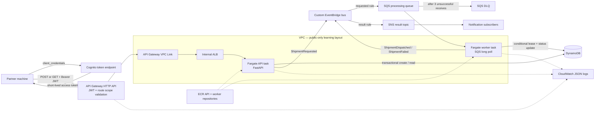

# Shipment Event Platform

`shipment-event-platform` is a learning-oriented, machine-to-machine shipment
processing API. It uses Python 3.12 containers on Amazon ECS/Fargate and raw AWS
CloudFormation—no SAM, CDK, Terraform, Kubernetes, Lambda, browser login, or
Cognito users.

## Architecture



AWS requires an Application Load Balancer to use at least two Availability Zone
subnets. To stay as close as possible to the requested one-subnet design, ECS
tasks and the VPC Link use one primary public subnet; a second `/27` public-route
subnet exists only so the internal ALB can attach to a second AZ. No tasks run in
that second subnet.

## Complete event flow

1. A partner machine requests an access token from Cognito with its client ID and
   secret using OAuth 2.0 `client_credentials`. Cognito returns an access token,
   not an ID or refresh token.
2. The machine sends `POST /shipments`, a bearer token with
   `shipment-api/shipments.write`, and an `Idempotency-Key`.
3. API Gateway verifies the JWT signature, issuer, audience/client ID, expiry,
   and route scope. It forwards authorized traffic over a VPC Link to the
   internal ALB. FastAPI deliberately performs **no second JWT validation**.
4. FastAPI validates the JSON, creates a shipment ID and event ID, and uses one
   DynamoDB transaction to write the `PENDING` shipment plus a separate
   idempotency-key record. The key is bound to a canonical SHA-256 request hash.
5. The API publishes `ShipmentRequested` to the custom EventBridge bus and
   returns HTTP `202`. A same-key/same-body replay returns the original shipment.
   A same-key/different-body replay returns `409`.
6. EventBridge matches the request event and sends its full envelope to SQS. The
   queue uses 20-second long polling and a 120-second visibility timeout.
7. The worker receives one message and conditionally acquires a DynamoDB
   processing lease. A concurrent duplicate cannot run the processor. A
   retryable exception releases the lease and leaves the message undeleted.
8. Successful work conditionally changes `PENDING` to `DISPATCHED`; a permanent
   business rejection changes it to `FAILED`. The worker publishes the result
   event and then marks that result as published.
9. EventBridge routes `ShipmentDispatched` and `ShipmentFailed` to SNS. Result
   event IDs are deterministic so downstream consumers can deduplicate them.
10. `GET /shipments/{id}` requires `shipment-api/shipments.read` and returns the
    strongly consistent DynamoDB status.
11. A message that remains unsuccessful after three receives is moved by SQS to
    the DLQ. Inspect and repair it before redriving it.

### At-least-once and failure safety

SQS, EventBridge, and SNS are at-least-once systems. This code never assumes a
single delivery:

- The API's idempotency transaction prevents two shipment records for one
  idempotency key.
- Replaying a successful POST republishes the same `ShipmentRequested` event ID.
  This deliberately closes most of the database/EventBridge dual-write failure
  window and can create a duplicate event.
- A crash after the status update but before result publication is repaired on
  the next delivery. A crash after publication but before the published flag can
  publish the deterministic result event twice.
- A real carrier adapter must also send `shipment_id` as the downstream
  idempotency key. If processing can exceed 120 seconds, extend both the SQS
  visibility timeout and DynamoDB lease together, ideally with a heartbeat.

The remaining API database/event-bus dual write is intentionally documented
rather than hidden: if DynamoDB commits, EventBridge fails, and the caller never
retries the same key, the shipment stays `PENDING`. A production design normally
uses a transactional outbox and a publisher service.

## AWS services

| Service              | Purpose                                                                                                            |
| -------------------- | ------------------------------------------------------------------------------------------------------------------ |
| CloudFormation       | Defines both stacks in reviewable raw YAML.                                                                        |
| ECR                  | Stores separately built API and worker images; tags are immutable and deploys require digest URIs.                 |
| ECS and Fargate      | Run the two long-lived containers without managing EC2 hosts.                                                      |
| API Gateway HTTP API | Public API endpoint, JWT validation, per-route OAuth scope enforcement, throttling, and access logs.               |
| Cognito user pool    | OAuth 2.0 authorization server with one resource server and a secret-bearing M2M app client. No users are created. |
| VPC Link             | Carries API Gateway traffic privately into the VPC.                                                                |
| Internal ALB         | Health-checks and routes HTTP traffic to IP-mode Fargate API targets.                                              |
| DynamoDB             | Stores shipment state and idempotency mappings in one on-demand, encrypted table.                                  |
| EventBridge          | Routes request events to SQS and result events to SNS by source and detail type.                                   |
| SQS and DLQ          | Buffer work, provide long polling/retries, and isolate messages after three failed receives.                       |
| SNS                  | Fans terminal results out to independently managed subscribers. The template does not create a subscription.       |
| CloudWatch Logs      | Retains API, worker, and API Gateway structured logs for seven days by default.                                    |
| IAM                  | Separates the ECS execution role from narrow API and worker task roles.                                            |

The API task role can only read/put this DynamoDB table and call `PutEvents` on
this event bus. DynamoDB authorizes the two `Put` operations inside
`TransactWriteItems` with `dynamodb:PutItem`. The worker can only receive/delete
from this queue, read/update this table, and put events on this bus. Neither task
can publish directly to SNS. EventBridge is authorized by resource policies on
SQS and SNS.

## Repository layout

```text
src/shipment_platform/       FastAPI, models, repository, worker, optional console
tests/unit/                  Validation, routes, status, idempotency, worker tests
tests/integration/           Moto-backed DynamoDB, EventBridge, and SQS tests
infra/bootstrap.yaml         Immutable ECR repositories
infra/platform.yaml          Complete runtime platform
docker/                      Python 3.12 non-root API, worker, and console images
scripts/bash/                Bash lifecycle commands
scripts/powershell/          PowerShell lifecycle commands
schemas/                     Request and event JSON Schemas
examples/                    Example API request and EventBridge envelopes
console.env.example           Safe placeholders for the local test console
compose.yaml                 API, worker, and optional local console services
```

## Local development and validation

Python 3.12 is required for the deployment images.

### Bash

```bash
python3.12 -m venv .venv
source .venv/bin/activate
python -m pip install -e ".[test]"
./scripts/bash/validate.sh
```

### PowerShell

```powershell
py -3.12 -m venv .venv
.\.venv\Scripts\Activate.ps1
python -m pip install -e ".[test]"
.\scripts\powershell\Validate.ps1
```

The validation scripts run pytest with coverage, `cfn-lint` on both templates,
and `docker compose config`. Integration tests use Moto and do not require AWS
credentials or create cloud resources.

Build and inspect the two local images:

```bash
docker compose build
docker compose up api
curl http://localhost:8000/health
docker compose down
```

```powershell
docker compose build
docker compose up api
Invoke-RestMethod http://localhost:8000/health
docker compose down
```

### Bash

```bash
export AWS_REGION=eu-north-1
export PROJECT_NAME=shipment-event-platform
./scripts/bash/bootstrap.sh
./scripts/bash/build.sh learning-v1
./scripts/bash/push.sh learning-v1
./scripts/bash/deploy.sh
```

### PowerShell

```powershell
$env:AWS_REGION = "eu-north-1"
.\scripts\powershell\Bootstrap.ps1
.\scripts\powershell\Build.ps1 -ImageTag learning-v1
.\scripts\powershell\Push.ps1 -ImageTag learning-v1
.\scripts\powershell\Deploy.ps1
```

The push command resolves both pushed tags to ECR digests and writes only the
immutable URIs to gitignored `.deployment.env`. The platform template independently
rejects non-digest image parameters.

## Obtain a token and call the API

For a complete deployed-platform test sequence—including health, authentication,
POST/GET, DynamoDB, logs, idempotency, scopes, queues, DLQ, SNS, and temporary
ECS scaling—see [AWS_TESTING_POWERSHELL.md](AWS_TESTING_POWERSHELL.md).

The app client secret is generated by Cognito and is deliberately absent from
CloudFormation outputs, source control, and logs. The principal running the
following diagnostic command needs `cognito-idp:DescribeUserPoolClient`. In a
real partner onboarding flow, deliver the secret once through an approved secret
manager and rotate it; do not send it in email or chat.

Tokens last 60 minutes. Cache and reuse them until shortly before expiry because
Cognito bills successful M2M token responses. Never write the client secret,
token response, or access token to a committed file.

## Optional local browser test console

The project includes an optional third **local testing container** that provides
a GUI for obtaining the M2M token, submitting shipments, looking up status, and
requesting an SNS email subscription. It is not part of `platform.yaml` and is
not deployed to AWS.

The security boundary is intentional:

- Cognito client credentials are environment variables in the console backend.
- The backend requests and caches the short-lived access token.
- The browser never receives the client secret or bearer token.
- SNS actions are fixed to the stack's result topic and email protocol.
- The port binds to `127.0.0.1`, so other machines cannot open the console.
- Console responses and browser storage do not persist credentials.

The easiest startup path reads the stack outputs, Cognito secret, and active AWS
CLI credentials into temporary process environment variables, without writing
them to a file:

```powershell
.\scripts\powershell\StartConsole.ps1
```

This requires a configured AWS CLI identity with
`cognito-idp:DescribeUserPoolClient`, `sns:Subscribe`, and
`sns:ListSubscriptionsByTopic` permissions. Docker Desktop must be running.
After startup, authentication, shipment requests, and email subscription
requests happen through the browser GUI. If the active AWS CLI session expires,
restart the console launcher to pass fresh credentials into the container.

---

Alternatively, start from the manually completed `.env.console` file:

Copy the placeholder configuration:

```powershell
Copy-Item .\console.env.example .\.env.console
```

Fill `.env.console` using:

- CloudFormation → `shipment-event-platform-dev` → **Outputs** for the API URL,
  token URL, client ID, and result-topic ARN.
- Cognito → the deployed user pool → app client for the generated client secret.

`.env.console` is gitignored. Never place its values in
`console.env.example`. Manual SNS controls also require AWS SDK credentials in
the Compose process environment; do not store long-lived AWS keys in
`.env.console`.

```powershell
docker compose `
  --env-file .env.console `
  --profile console `
  up --build console
```

Open:

```text
http://127.0.0.1:8088
```

The **Get or refresh token** button performs the `client_credentials` request
server-side. **Submit shipment** forwards the JSON and `Idempotency-Key` through
API Gateway. **Get status** calls the protected GET route. **Subscribe** calls
SNS using AWS IAM credentials and the fixed result-topic ARN. AWS sends a
confirmation email; notifications start only after its link is opened, and
earlier topic messages are not replayed.

Stop the local container with `Ctrl+C`, or:

```powershell
docker compose `
  --env-file .env.console `
  --profile console `
  stop console
```

Stopping this container has no effect on the deployed AWS stack.

## Simplified-network security and production limitations

What this learning stack does:

- The ALB is `internal`.
- The ALB listener accepts only the VPC Link security group.
- API tasks accept port 8000 only from the ALB security group.
- Worker tasks have no ingress rule.
- API and worker egress is limited to TCP 443.
- Both tasks use temporary ECS task-role credentials and receive no static AWS
  keys or OAuth secrets.
- API Gateway validates JWTs and separate read/write scopes before traffic
  enters the VPC.

What it does **not** provide:

- Tasks run in one AZ and have public IPv4 addresses to reach regional AWS public
  endpoints. Security groups block unsolicited ingress, but this is not the
  private-subnet posture expected in production.
- There is no NAT gateway or VPC endpoints, no egress proxy, and no fine-grained
  destination allowlist.
- The API Gateway-to-ALB and ALB-to-container hops use HTTP inside the VPC.
- The ALB's mandatory second subnet has no tasks, so this is not multi-AZ compute.
- There is no AWS WAF, custom domain, ACM certificate, automatic scaling,
  CloudWatch alarms, tracing, DynamoDB PITR, cross-region recovery, or automated
  DLQ redrive.
- The result SNS topic uses service-managed transport security but no customer
  managed KMS key. Subscribers are outside this stack.
- One Cognito app client represents the example partner. Production onboarding
  normally uses a client per partner, Secrets Manager, rotation, revocation, and
  audit automation.
- The request-event dual write uses retry recovery instead of a transactional
  outbox.

For production, use private task subnets across at least two AZs, VPC endpoints
or controlled NAT egress, TLS on internal hops, WAF/custom domain, Fargate
autoscaling, PITR/backups, alarms for DLQ depth and service health, secret
rotation, and a transactional outbox.

## Troubleshooting

**CloudFormation rejects an image parameter**

Run the push script. The template accepts
`repository-uri@sha256:<digest>`, not a mutable `:tag`.

**ECS task cannot pull an image**

Confirm the image is in the same account/region, its repository begins with the
project prefix, the digest exists, the task has a public IP, and the primary
subnet default route points to the internet gateway. Check the ECS service event.

**ALB target is unhealthy**

Check `/ecs/shipment-event-platform/dev/api`, verify the task is listening on
port 8000, and confirm the API task security group allows only the ALB security
group. The health response must be `{"status":"ok"}`.

**API Gateway returns 401**

Use the access token—not an ID token—before its `exp`, confirm the token issuer
matches this user pool and the access token belongs to the output client ID.

**API Gateway returns 403**

Request the scope required by the route. POST needs `shipments.write`; GET needs
`shipments.read`.

**API Gateway returns 500/503**

Inspect the API Gateway integration error field, ALB target health, and API JSON
logs. A POST publication failure returns `503`; retry the identical JSON with the
same `Idempotency-Key`.

**Shipment remains PENDING**

Inspect the EventBridge rule metrics, processing queue depth, worker ECS events,
and worker logs. Check that the request event ID matches the DynamoDB item.

**Messages reach the DLQ**

Inspect the message body and `ApproximateReceiveCount`, fix the processor or
schema problem, and redrive only after verifying that processing is idempotent.
Malformed events intentionally fail until SQS moves them after three receives.

**Cleanup stack deletion fails**

Delete external SNS subscriptions or resources that reference stack resources,
then retry. ECR repositories use `EmptyOnDelete`, so deleting the bootstrap stack
also permanently removes its images.

## Cleanup

Cleanup deletes the DynamoDB table and shipment data, both queues and their
messages, logs, Cognito resources, and ECR images. It cannot be undone.

```bash
CONFIRM=DELETE ./scripts/bash/cleanup.sh
```

```powershell
.\scripts\powershell\Cleanup.ps1 -Confirm DELETE
```

The order matters: delete the platform stack first, wait for completion, then
delete the bootstrap/ECR stack. Both cleanup scripts enforce that order.

## References

- [Cognito client credentials token endpoint](https://docs.aws.amazon.com/cognito/latest/developerguide/token-endpoint.html)
- [Cognito M2M scopes and resource servers](https://docs.aws.amazon.com/cognito/latest/developerguide/cognito-user-pools-define-resource-servers.html)
- [API Gateway private ALB integration](https://docs.aws.amazon.com/apigateway/latest/developerguide/http-api-develop-integrations-private.html)
- [EventBridge resource-based policies](https://docs.aws.amazon.com/eventbridge/latest/userguide/eb-use-resource-based.html)
- [DynamoDB transaction IAM authorization](https://docs.aws.amazon.com/amazondynamodb/latest/developerguide/transaction-apis-iam.html)
- [ALB subnet requirements](https://docs.aws.amazon.com/elasticloadbalancing/latest/application/application-load-balancers.html)
